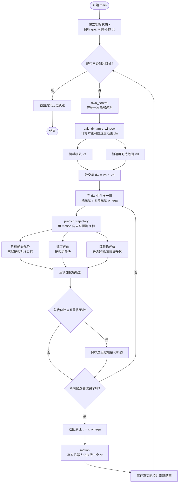
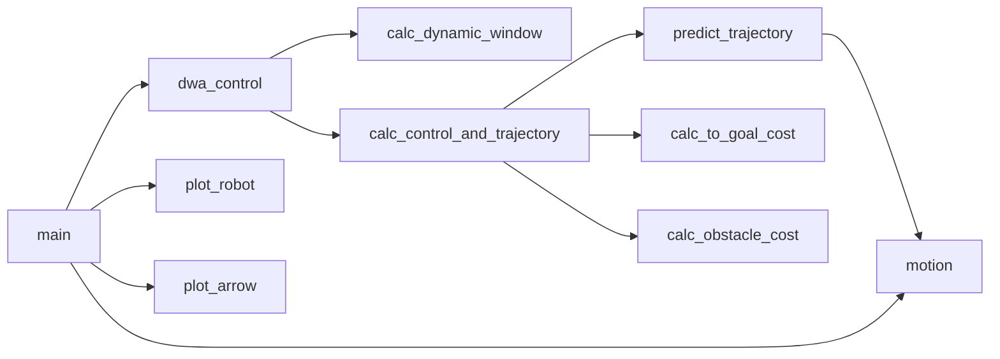

# DWA 动态窗口法：零基础阅读指南

这份指南对应同目录的 `dynamic_window_approach.py`。建议先看下面的生活化解释和流程图，再按“推荐阅读顺序”进入源码。

## 1. 先不谈公式：DWA 到底在做什么

想象你正在拥挤的停车场里开一辆只能前进/后退和转弯的小车。每隔 0.1 秒，你都做一次非常短的决定：

1. 我现在的速度是多少？
2. 受电机能力限制，下一瞬间我能把速度变到什么范围？
3. 如果“慢速左转”“快速直行”“倒车右转”……分别保持 3 秒，会走出什么轨迹？
4. 哪条轨迹既朝着终点、又比较快、还离障碍物远？
5. 选最好的一条，但只执行最前面的 0.1 秒。
6. 0.1 秒后重新观察、重新预测、重新选择。

这就是 DWA。它不是提前承诺走完整条路线，而是不断“向前看几秒，只走一小步”。这类反复更新的做法叫闭环控制或滚动规划。

## 2. 总流程图



最重要的是区分两种轨迹：

- `predicted_trajectory`：机器人在脑中试跑出来的未来轨迹，每轮都会变化，动画里是绿线。
- `trajectory`：机器人真正执行后留下的历史轨迹，仿真结束时画成红线。

## 3. 五维状态 `x` 是什么

代码把机器人当前情况压缩成一个长度为 5 的数组：

```text
x = [px, py, yaw, v, omega]
```

| 下标 | 名称 | 含义 | 单位 |
|---:|---|---|---|
| `x[0]` | `px` | 世界坐标系中的横坐标 | m |
| `x[1]` | `py` | 世界坐标系中的纵坐标 | m |
| `x[2]` | `yaw` | 机器人朝向角 | rad |
| `x[3]` | `v` | 当前线速度；负数表示倒车 | m/s |
| `x[4]` | `omega` | 当前角速度；正负代表相反转向 | rad/s |

控制输入只有两项：

```text
u = [v, omega]
```

也就是说，算法真正要做的选择不是“下一点在哪里”，而是“接下来使用什么线速度和角速度”。

## 4. `motion`：一组速度怎样变成位置

在一个很短的 `dt` 内，代码假设 `v` 和 `omega` 不变：

```text
yaw = yaw + omega × dt
px  = px  + v × cos(yaw) × dt
py  = py  + v × sin(yaw) × dt
```

直观理解：

- `omega × dt` 是这段时间转过的角度；
- `v × dt` 是这段时间向前走过的距离；
- `cos(yaw)` 和 `sin(yaw)` 把“向前距离”拆成世界坐标中的 x、y 分量。

例如，机器人朝向 0°、速度 1 m/s、`dt=0.1 s`，它大约向 x 正方向走 0.1 m；朝向 90° 时则大约向 y 正方向走 0.1 m。

这只是简化模型，没有模拟轮胎打滑、电机延迟等真实现象，但足够展示 DWA 的核心思想。

## 5. 为什么叫“动态窗口”

算法先构造两个速度范围。

### 5.1 机器人绝对能力 `Vs`

```text
Vs = [min_speed, max_speed, -max_yaw_rate, max_yaw_rate]
```

这是硬件允许的全局范围。无论何时，速度都不能越过它。

### 5.2 当前周期能够到达的范围 `Vd`

```text
v_min = 当前v - max_accel × dt
v_max = 当前v + max_accel × dt
w_min = 当前omega - max_delta_yaw_rate × dt
w_max = 当前omega + max_delta_yaw_rate × dt
```

它体现“速度不能瞬间跳变”。以默认参数为例：

- 当前速度为 `0 m/s`；
- 最大加速度为 `0.2 m/s²`；
- 一个周期为 `0.1 s`。

那么下一周期线速度只能落在：

```text
[-0.02, 0.02] m/s
```

虽然机器人的最高速度是 `1.0 m/s`，但它不可能在 0.1 秒内从静止瞬移到最高速度。

### 5.3 两者取交集

```text
dw = Vs ∩ Vd
```

代码中表现为“下限取较大者，上限取较小者”。这个交集就是当前时刻的动态窗口。机器人速度改变后，下一轮的 `Vd` 也随之改变，因此窗口是动态的。

## 6. 怎样从窗口中产生候选轨迹

`calc_control_and_trajectory` 使用两层循环：

```text
for 每一个候选线速度 v:
    for 每一个候选角速度 omega:
        预测这组速度对应的轨迹
        给轨迹打分
```

如果本轮有 5 个线速度样本和 81 个角速度样本，就要预测 `5 × 81 = 405` 条轨迹。

`v_resolution` 和 `yaw_rate_resolution` 决定采样间隔：

- 间隔小：选择更精细，轨迹更多，计算更慢；
- 间隔大：计算更快，但可能错过更好的速度组合。

对每组候选速度，`predict_trajectory` 从完全相同的当前状态出发，重复调用 `motion`，一直模拟到 `predict_time`。默认 `dt=0.1 s`、预测 3 秒，所以每条轨迹大约包含 31 次运动后的状态，外加最初状态。

## 7. 三位“裁判”怎样打分

最终代价是三项加权和：

```text
final_cost =
    to_goal_cost_gain × 目标朝向代价
  + speed_cost_gain   × 速度代价
  + obstacle_cost_gain × 障碍物代价
```

所有代价都遵循同一个规则：**越小越好**。

### 7.1 目标朝向代价

代码先从预测轨迹的末端位置画一支“指向目标”的虚拟箭头，再比较：

- 虚拟箭头的角度；
- 机器人在预测轨迹末端的朝向。

两者夹角越小，说明轨迹末端越对准目标，代价越小。返回范围为 0 到 π：

- `0`：正对目标；
- `π/2`：与目标方向垂直；
- `π`：背对目标。

注意：当前实现只比较朝向，没有直接把“末端离目标还有多远”加入这一项。

### 7.2 速度代价

```text
speed_cost = max_speed - 轨迹末端线速度
```

越接近最高前进速度，差值越小，所以这项鼓励机器人不要无缘无故慢吞吞或倒车。

### 7.3 障碍物代价

安全轨迹使用：

```text
obstacle_cost = 1 / 整条预测轨迹中的最近障碍物距离
```

因此：

- 最近距离 5 m，代价 0.2；
- 最近距离 1 m，代价 1；
- 距离越近，代价增长越明显；
- 发生碰撞，代价直接变成正无穷 `inf`。

任何有限数都比 `inf` 小，所以只要存在安全轨迹，碰撞轨迹就不可能被选中。

## 8. 圆形和矩形机器人如何检查碰撞

### 8.1 圆形机器人

只需计算机器人中心到障碍物点的距离。如果任何距离小于等于 `robot_radius`，障碍物就进入圆内，判定碰撞。

### 8.2 矩形机器人

矩形会随 `yaw` 旋转，直接在世界坐标中判断很麻烦。因此代码反过来处理：

1. 把障碍物坐标减去机器人中心，完成平移；
2. 根据机器人朝向旋转这些相对坐标；
3. 在机器人自己的局部坐标系里，机器人始终是摆正的矩形；
4. 检查障碍物点是否同时位于前、后、左、右四条边以内。

这相当于不去旋转矩形，而是把整个世界反向旋转到机器人坐标系中。

## 9. 为什么只执行预测轨迹的第一小步

假设算法预测出未来 3 秒的绿线，但它只执行 0.1 秒。这样做有三个好处：

1. 下一轮可以使用新的位置和速度重新计算；
2. 如果障碍物或环境变化，不必坚持旧计划；
3. 预测模型有误差时，误差不会一次积累 3 秒才修正。

所以 `predict_time` 是“看多远”，`dt` 是“每次真正走多远对应的时间”。不要把两者混为一谈。

## 10. 防止卡死的特殊规则

有时机器人正对目标，却被障碍物挡住。评分可能认为 `v=0、omega=0` 最安全，于是机器人永远停住。

代码检查：

- 当前机器人线速度几乎为 0；
- 本轮最佳线速度也几乎为 0。

满足时就强制设置一个负方向角速度，让机器人先转起来。下一轮，新的朝向可能产生一条能绕开障碍物的安全轨迹。

这是工程上的脱困小技巧，不是 DWA 三项基本代价的一部分。

## 11. 主循环与函数调用关系



这里 `motion` 被调用在两个不同场景：

- `predict_trajectory -> motion`：在机器人“脑中”试跑候选轨迹；
- `main -> motion`：让仿真中的真实机器人执行选中控制量一个 `dt`。

## 12. 推荐源码阅读顺序

不要从第一行机械地读到最后一行。按下面顺序更容易建立整体概念：

1. `main`：先看闭环怎样反复运行；
2. `dwa_control`：看一轮规划只有哪两大步骤；
3. `calc_dynamic_window`：理解搜索范围从哪里来；
4. `calc_control_and_trajectory`：理解采样、预测、评分、选最优；
5. `predict_trajectory` 和 `motion`：理解轨迹怎样生成；
6. `calc_to_goal_cost`：理解目标方向评分；
7. `calc_obstacle_cost`：最后再看广播、坐标变换和碰撞检测；
8. `plot_robot`、`plot_arrow`：它们只负责显示，不影响决策。

## 13. 动画里的符号

| 图形 | 含义 |
|---|---|
| 绿色曲线 | 当前这一轮选中的最佳预测轨迹 |
| 红色叉号 | 机器人当前中心位置 |
| 蓝色叉号 | 目标位置 |
| 黑色圆点 | 障碍物点 |
| 蓝色圆/黑色矩形 | 机器人的碰撞外形 |
| 黑色箭头或方向线 | 机器人当前朝向 |
| 最后的红色曲线 | 机器人真正走过的完整历史轨迹 |

## 14. 调参时各参数会造成什么现象

| 参数 | 增大后通常会怎样 |
|---|---|
| `predict_time` | 看得更远，计算更慢，也可能更早绕障碍 |
| `dt` | 每条预测轨迹的点更稀、真实执行步子更大，精细度下降 |
| `v_resolution` | 线速度采样更粗，计算更快但选择更少 |
| `yaw_rate_resolution` | 转向采样更粗，计算更快但弯道选择更少 |
| `to_goal_cost_gain` | 更强调尽快把车头对准目标 |
| `speed_cost_gain` | 更偏好高速，过大时可能显得激进 |
| `obstacle_cost_gain` | 更愿意远离障碍，过大时可能过于保守 |
| `robot_radius` | 圆形碰撞范围和到达目标阈值都变大 |

权重没有适合所有机器人的固定答案。它们还受速度上限、地图尺度和传感器噪声影响。调参时最好一次只改一项，并观察机器人在同一场景中的变化。

## 15. 这份示例做了哪些简化

理解这些边界，可以避免把演示代码误认为完整产品：

- 障碍物是静态点，没有速度和形状；
- 预测期间假设控制量恒定；
- 使用简化运动模型，没有动力学、侧滑和控制延迟；
- 没有全局路径引导，复杂迷宫中可能陷入局部最优；
- 基础 DWA 论文常讨论“能否在碰撞前刹停”的 admissible velocity，
  这个示例主要通过有限时域轨迹碰撞检测筛选候选，没有单独实现完整制动约束；
- 矩形机器人发生碰撞时按真实矩形判断，但非碰撞代价仍使用中心到障碍点的距离。

## 16. 常见疑问

### DWA 是全局路径规划吗？

不是。这里的 DWA 是局部规划/局部控制：根据当前状态和附近障碍物决定短期速度。实际系统常先由 A*、Dijkstra 等全局规划器给出大方向，再让局部规划器跟踪并避障。

### 为什么最佳轨迹看起来每帧都在变？

因为每执行一个 `dt`，机器人的位置、朝向和速度都会变化，动态窗口也跟着变化。每帧重新规划正是算法设计的一部分。

### 为什么目标代价不直接计算到目标的距离？

这是该示例选择的评分方式：让机器人末端朝向目标，同时由速度项推动前进。在别的实现中，完全可以增加终点距离、路径偏差、平滑度等代价。

### 为什么最后用了 `min_cost >= final_cost`，不是严格的 `>`？

这意味着遇到相同分数时，后遍历到的候选轨迹会覆盖之前的结果。通常差异很小，但采样顺序会成为平分时的决胜规则。

### 为什么 `np.arange` 可能不包含窗口上限？

`np.arange(start, stop, step)` 通常生成小于 `stop` 的值，而且浮点数还有舍入误差。因此代码是在窗口内近似采样，不保证两个上限一定成为候选值。

## 17. 用一句伪代码收尾

```text
只要还没到目标：
    计算当前周期能达到的速度窗口
    最佳分数 = 无穷大

    对窗口里的每一组 [线速度, 角速度]：
        预测未来轨迹
        计算朝向目标、速度、障碍物三项代价
        如果总代价更小：
            记住这组速度和轨迹

    真实机器人只执行最佳速度一个很短周期
    用新状态重新开始
```

抓住“**速度空间采样 → 未来轨迹预测 → 多目标打分 → 只执行一小步 → 重复**”，就抓住了这份 DWA 代码的主干。
